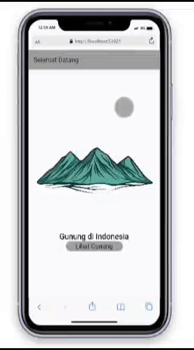
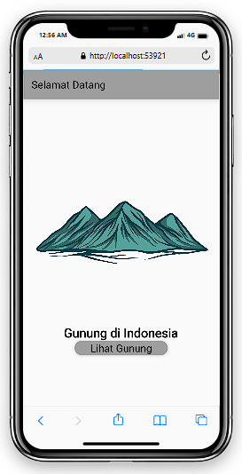
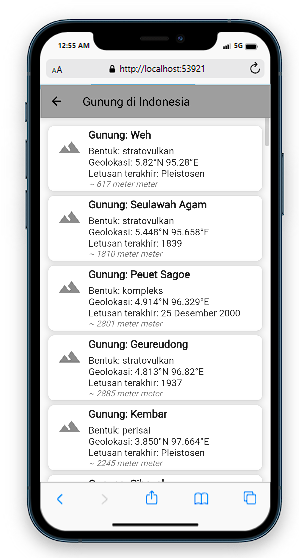

# API-FLUTTER
# UI--Practice-Flutter-UAS

UI Practice Flutter UAS

This project is an assignment from my class
#### NAMA : Ravansa Rahman Santosa
#### NIM : 312110103
#### Kelas : TI.21.A2
#### MatKul : Pemrograman Mobile
### API yang di gunakan
'https://indonesia-public-static-api.vercel.app/api/volcanoes'
### Hasil Penggunaan API ke Flutter

### Pertama Foto Hasilya
### 
### 
Membuat beberapa file dart baru yaitu depan.dart dan halaman.dart

### Mencantumkan dependensi yang diperlukan oleh proyek Flutter. 
yaitu versi http: ^0.13.5
dan assets untuk gambar gunung
assets:
    - assets/image/gunung_image.png

### Membuat file depan.dart dan halaman.dart
### code depan.dart
```
import 'package:flutter/material.dart';
import 'package:http/http.dart' as http;
import 'package:api/halaman.dart';
import 'dart:convert';

class Depan extends StatelessWidget {
  final String apiUrl =
      "https://indonesia-public-static-api.vercel.app/api/volcanoes";

  const Depan({Key? key}) : super(key: key);

  Future<dynamic> _fecthDepan() async {
    var result = await http.get(Uri.parse(apiUrl));
    return json.decode(result.body);
  }

  @override
  Widget build(BuildContext context) {
    return Scaffold(
      appBar: AppBar(
        title: const Text('Selamat Datang'),
      ),
      body: FutureBuilder<dynamic>(
        future: _fecthDepan(),
        builder: (BuildContext context, AsyncSnapshot snapshot) {
          if (snapshot.hasData) {
            return Container(
              decoration: BoxDecoration(
                image: DecorationImage(
                  image: AssetImage("assets/images/background.jpg"),
                  fit: BoxFit.cover,
                ),
              ),
              child: Column(
                mainAxisAlignment: MainAxisAlignment.center,
                children: [
                  Container(
                    margin: const EdgeInsets.all(20),
                    child: Image.asset(
                      'assets/image/gunung_image.png',
                      width: 500,
                      height: 300,
                    ),
                  ),
                  const Text(
                    'Gunung di Indonesia',
                    style: TextStyle(fontSize: 24, fontWeight: FontWeight.bold),
                  ),
                  ElevatedButton(
                    onPressed: () {
                      Navigator.push(
                        context,
                        MaterialPageRoute(
                          builder: (context) => const Halaman(),
                        ),
                      );
                    },
                    style: ElevatedButton.styleFrom(
                      primary: Colors.grey,
                      padding: const EdgeInsets.symmetric(
                          vertical: 10, horizontal: 30),
                      shape: RoundedRectangleBorder(
                        borderRadius: BorderRadius.circular(20),
                      ),
                    ),
                    child: const Text(
                      'Lihat Gunung',
                      style: TextStyle(fontSize: 20),
                    ),
                  ),
                ],
              ),
            );
          } else {
            return const Center(child: CircularProgressIndicator());
          }
        },
      ),
    );
  }
}
```


### halaman.dart


```
import 'package:flutter/material.dart';
import 'package:http/http.dart' as http;
import 'dart:convert';

class Halaman extends StatelessWidget {
  final String apiUrl =
      "https://indonesia-public-static-api.vercel.app/api/volcanoes";

  const Halaman({Key? key}) : super(key: key);

  Future<List<dynamic>> _fetchHalaman() async {
    var result = await http.get(Uri.parse(apiUrl));
    return json.decode(result.body);
  }

  @override
  Widget build(BuildContext context) {
    return Scaffold(
      appBar: AppBar(
        title: const Text('Gunung di Indonesia'),
      ),
      body: FutureBuilder<List<dynamic>>(
        future: _fetchHalaman(),
        builder: (BuildContext context, AsyncSnapshot snapshot) {
          if (snapshot.hasData) {
            return ListView.builder(
              padding: const EdgeInsets.all(10),
              itemCount: snapshot.data.length,
              itemBuilder: (BuildContext context, int index) {
                var gunungData = snapshot.data[index];

                return Card(
                  elevation: 4,
                  shape: RoundedRectangleBorder(
                    borderRadius: BorderRadius.circular(10),
                  ),
                  child: ListTile(
                    leading: Icon(Icons.terrain, size: 40),
                    title: Column(
                      crossAxisAlignment: CrossAxisAlignment.start,
                      children: [
                        Text(
                          'Gunung: ${gunungData['nama']}',
                          style: TextStyle(
                            fontWeight: FontWeight.bold,
                            fontSize: 18,
                          ),
                        ),
                        SizedBox(height: 8),
                        Text(
                          'Bentuk: ${gunungData['bentuk']}',
                        ),
                        Text(
                          'Geolokasi: ${gunungData['geolokasi']}',
                        ),
                        Text(
                          'Letusan terakhir: ${gunungData['estimasi_letusan_terakhir']}',
                        ),
                      ],
                    ),
                    subtitle: Text(
                      "~ ${gunungData['tinggi_meter']} meter",
                      style: TextStyle(fontStyle: FontStyle.italic),
                    ),
                  ),
                );
              },
            );
          } else {
            return Center(child: CircularProgressIndicator());
          }
        },
      ),
    );
  }
}

```
### Terakhit membuat main.dart
```
           import 'package:api/depan.dart';
import 'package:flutter/material.dart';

void main() => runApp(const MyApp());

class MyApp extends StatelessWidget {
  const MyApp({super.key});

  // This widget is the root of your application.
  @override
  Widget build(BuildContext context) {
    return MaterialApp(
      title: 'Belajar API',
      debugShowCheckedModeBanner: false,
      theme: ThemeData(
        primarySwatch: Colors.grey,
      ),
      home: const Depan(),
    );
  }
}

```
### Referensi Tutorial
https://afandistudio.net/mendapatkan-data-api-di-flutter/
